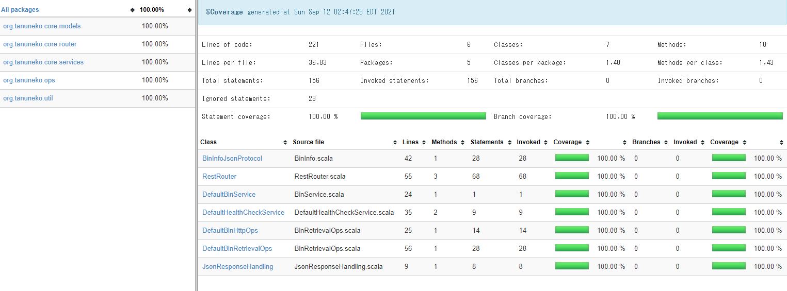

# Scala Akka-Http Project Template

This sample project can be used as a template for Scala micro service using akka-http.

# SDLC rule

## Code format

This project uses scalafmt. When you make a code change, make sure you run the below command.

`scalafmtAll`

## Test coverage

Bin service module expects to see 70%+ unit test coverage. Otherwise the build will be forced to fail.
To see current code coverage at your local, run the following sbt commands.

```
1. clean
2. coverage 
3. test
4. coverageReport
```

Once step 4 is done, under binLookup/target/test-reports you will find test coverage reports with HTML format.



Once local coverage check is done, make sure you run the below command.

`coverageOff`
